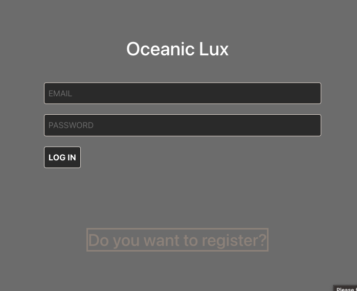
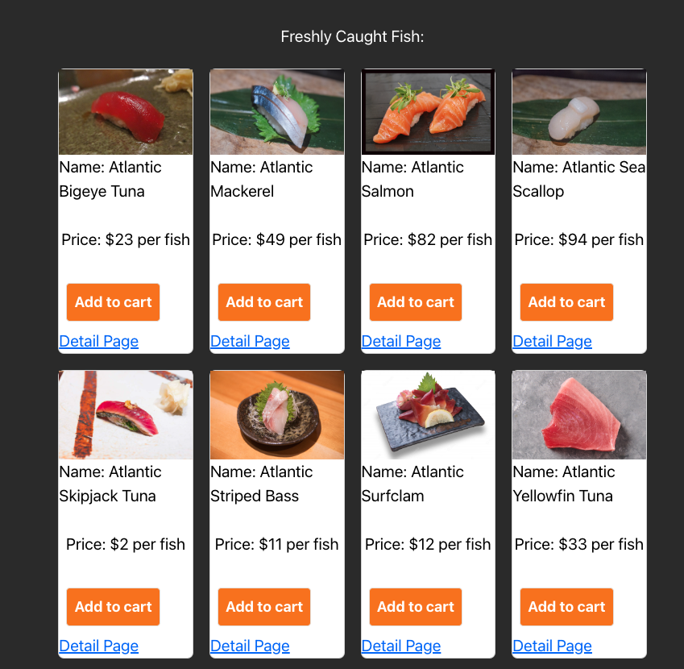
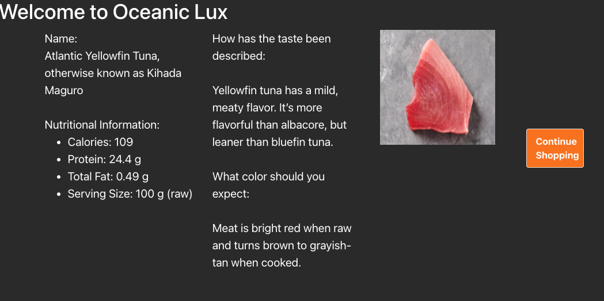
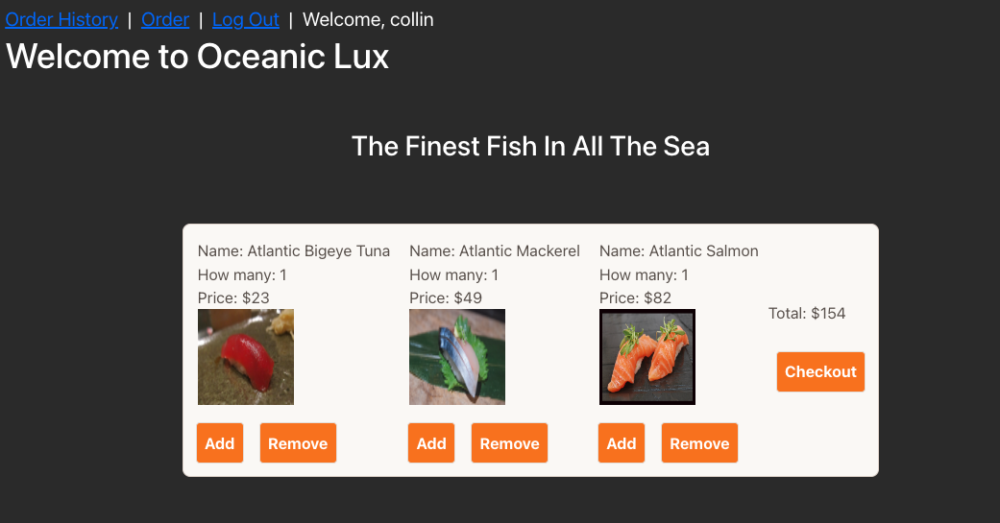
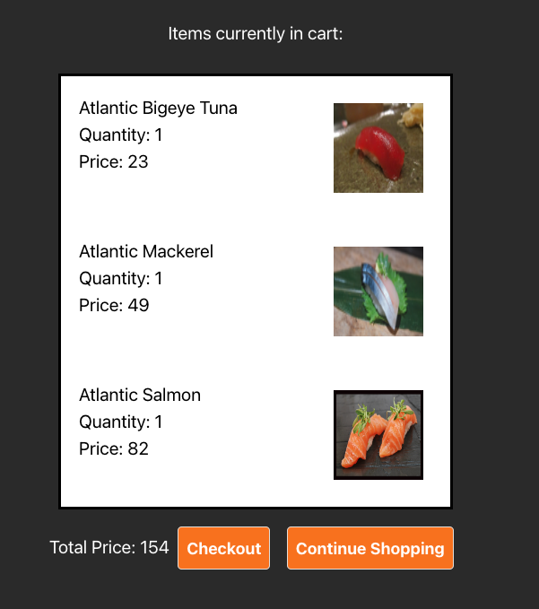
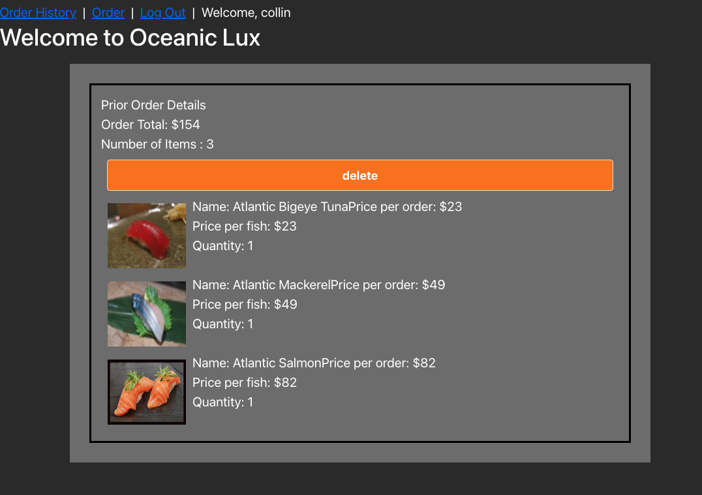

# Project-3-Fish-Market

# <strong><em> Oceanic Lux : Procuring the Finest Fish in the Sea  </em></strong>

***

## Oceanic Lux Overview

Welcome to the finest e-commerce procurement site for all your fishy needs! On this site, you are able to browse our catalog of <em>fish</em>, view specific details on each fish, add/remove said fish to your cart, view past orders, and delete past orders (because no one needs to know your fishy dealings).

The data is pulled through Danny Yu's API which is connected to the FishWatch API. This API is used to seed our database. 

***

## Technologies Used

***

## Getting Started

*Feel free to visit our shop [here](https://oceaniclux.herokuapp.com/)

* Begin by signing up, or logging in to our website
* Click on the order link in the navbar at the top to see our catalog
* Browse our selection of <em>fresh</em> fish
* At this point you can either add/remove to your cart, or you can select the detail link that will provide more information on selected fish
* After selecting the fish you want, click on the checkout button to take you to our checkout page
* From here you can either checkout, or click continue shopping in case you missed an item you'd like
* Once checkout is finished, you can view all your past orders on the order history link. 
* This view will list all of your previous orders, and gives you the option to delete them too. 

***

## Next Steps

* adding more fish data - <strong>because who doesn't like more fish </strong>
* incorporating linked lists to create product recommendations
* refreashing the styling to create a more modern look - more fish, cleaner design, more images!!!
* incorporating an AI based API that will generate recipes, or haikus for each fish

***

## Notable Mentions:

*Thank you to the instructional team at General Assembly for offering their guidance and support
*Thank you to Jim Clark at General Assembly for his work on SEI-Cafe which was an inspiration for this project
*Thank you to Danny Yu and his amazing API that is used to power this store. Here is his [GitHub](https://github.com/DannyYu728/whats-that-fish)

***

##Images/Links

 -- 
 -- 
 -- 
 -- 
 -- 
 -- 

[Trello](https://trello.com/invite/b/kVV5E1ce/ATTI1eefc1d1136b770feb1b1a3d3227b70e61A966AE/project-3) --
[Wireframe](https://whimsical.com/project-GTr3nkU9Dv1M5sSWSmhciU) --
[ERD](https://lucid.app/lucidchart/02d3b0d3-c3a3-46dd-a0d4-387e8d1862cc/edit?viewport_loc=120%2C39%2C969%2C368%2C0_0&invitationId=inv_45e533d9-00df-4347-bc50-9a96e4d41b4c)

